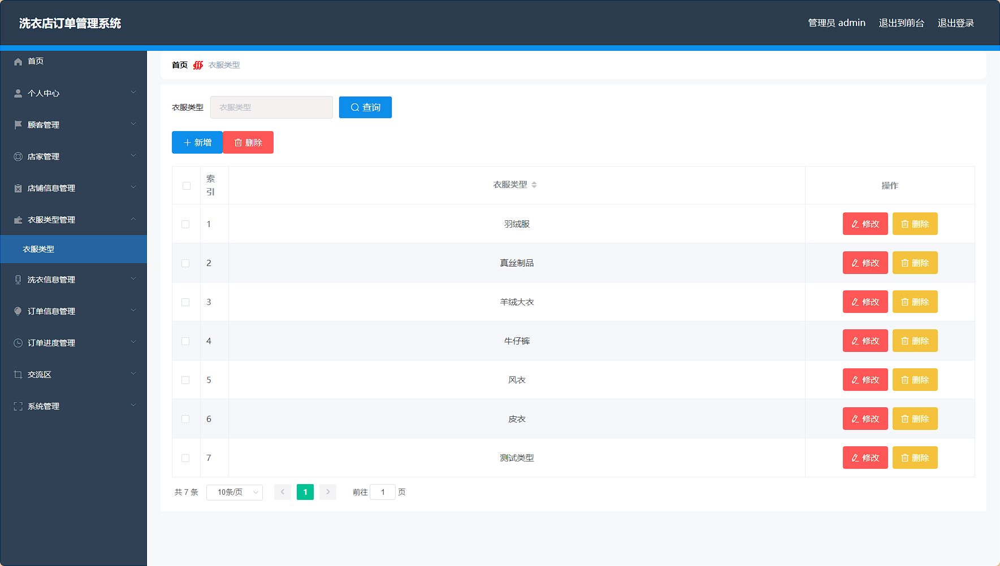
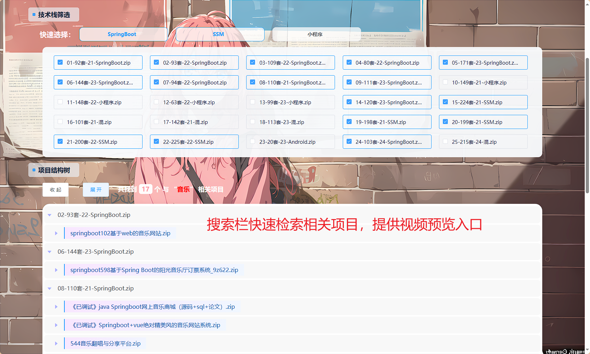

# springboot 洗衣店订单管理系统 / springboot-Laundry Order Management System


> 更多毕设项目可跳转至项目导航栏检索：[毕设项目](http://sysadmin.3vfree.vip)，需要联系博主v：xq-lucky311，q：1047944234. 备注：项目咨询注：由于前端项目太大，仅上传了后端代码，未包含前端代码...

## 项目简介  
基于SpringBoot + Vue + MyBatis Plus的洗衣店订单管理系统，包含管理员、顾客、店家三种角色，实现店铺管理、洗衣信息管理、订单跟踪、交流区等功能。

## 特征介绍  
- **权限控制**：集成Shiro实现管理员/顾客/店家三角色动态权限管理  
- **高效开发**：MyBatis Plus简化数据库操作，零SQL实现单表CRUD  
- **前后端分离**：Vue前端框架 + SpringBoot RESTful API架构  
- **模块化设计**：实体/模型/视图分层结构，支持业务扩展  
- **文件管理**：集成上传工具类，支持洗衣凭证等文件存储  

## 代码结构 
```src/
├── main/
│ ├── java/
│ │ ├── com/
│ │ │ ├── SpringbootSchemaApplication.java # 启动类
│ │ │ ├── annotation/ # 鉴权注解
│ │ │ │ ├── APPLoginUser.java
│ │ │ │ ├── IgnoreAuth.java
│ │ │ │ ├── LoginUser.java
│ │ │ ├── config/ # 全局配置
│ │ │ │ ├── InterceptorConfig.java
│ │ │ │ ├── MybatisPlusConfig.java
│ │ │ ├── controller/ # 接口层
│ │ │ │ ├── ChatController.java
│ │ │ │ ├── CommonController.java
│ │ │ │ ├── DianjiaController.java
│ │ │ │ ├── DianpuxinxiController.java
│ │ │ │ ├── DingdanjinduController.java
│ │ │ ├── dao/ # 数据访问层
│ │ │ │ ├── ChatDao.java
│ │ │ │ ├── DianjiaDao.java
│ │ │ │ ├── DianpuxinxiDao.java
│ │ │ │ ├── DingdanjinduDao.java
│ │ │ ├── entity/ # 数据模型
│ │ │ │ ├── ChatEntity.java
│ │ │ │ ├── DianjiaEntity.java
│ │ │ │ ├── DianpuxinxiEntity.java
│ │ │ │ ├── DingdanjinduEntity.java
│ │ │ │ ├── model/ # 业务模型
│ │ │ │ │ ├── DianjiaModel.java
```


## 使用说明  
**推荐浏览器**：谷歌浏览器  
**后台地址**：http://localhost:8080/springboot4691l/admin/dist/index.html  
**管理员账号**：abo / abo  
**前台地址**：http://localhost:8080/springboot4691l/front/index.html  
**数据库配置**：修改`application.yml`中的数据库连接信息（url/username/password）

# 项目实际截图：
## 登录：


## 前台：


## 后台：





> 等等...

# 精选项目导航 & 快速部署工具
## 项目资源一站直达
- ​**访问项目导航站**：[点击进入](http://sysadmin.3vfree.vip)**快速检索所需项目名称**
- ​**技术栈全覆盖**：Java/SSm/Spring Boot/小程序等主流技术方案
- ​**配套资源**：每个项目均提供部署文档 + 演示视频（附效果截图）

### ▌导航站预览


### ▌工具界面预览


## 捐赠
> 博主将持续更新Java全栈开发项目，包含ssm，springboot，前后端分离系统等项目。
> 此外如果您够宽裕，请博主喝杯咖啡吧！捐赠将用于服务器维护与开源社区建设，感谢您的认可！
> 如需更多Java相关项目毕设3000+，有其他项目需求，sql文件等可联系博主v:xq-lucky311

---
